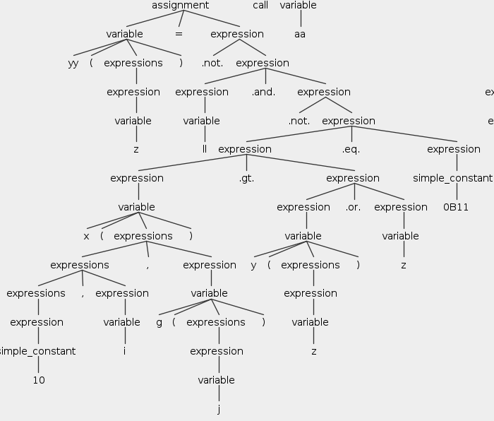
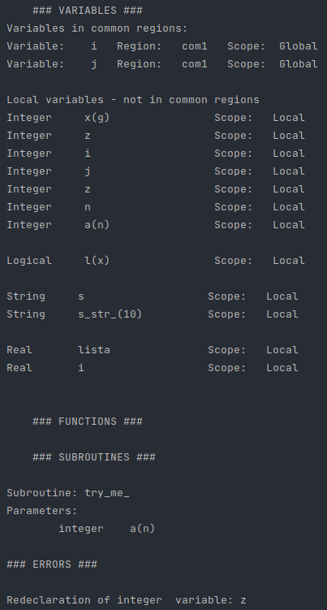

# Simple Fortran
___
This university project is the implementation of the lexical analysis, syntactic analysis
and
semantic analysis of a grammar called
`Simple Fortran`. The tool that was used is [Antlr v4](https://www.antlr.org/) and Java.

Compilers - 4th semester Computer Science @ [AUTh](https://www.auth.gr/)

Files: `input2.f`, `input.2` and `test4_ok.f` are examples of the grammar for testing.

## Grammar 
Grammar is defined in file `src/SimpleFortran.g4` and in file `Greek_Description.pdf`, which is in Greek.
## Semantic Analysis
Semantic Analysis is implemented in files `Runner.java` and `Visitor.java`.
The syntactic tree for the test file `input2.f` is shown below.

The symbol table for the test file `input2.f` is shown below.

